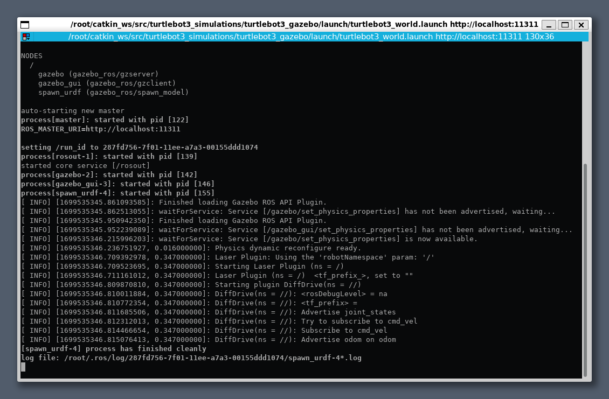
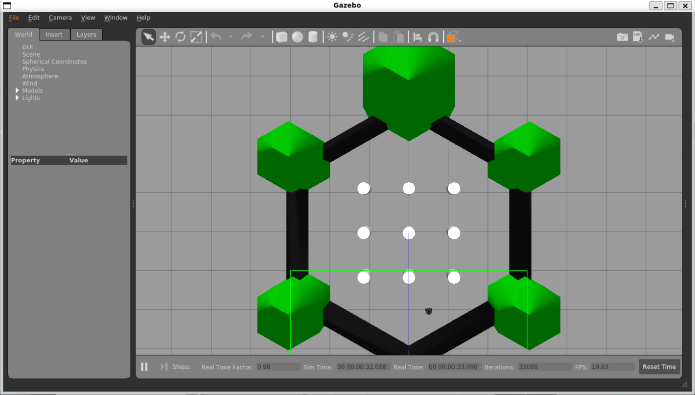

# my-ros-setup

## prerequisite

- windows + WSL


## resource

- https://github.com/turlucode/ros-docker-gui

## build

```
./script.sh
```

## run

```
./script.sh run
```

## run in docker

```
export TURTLEBOT3_MODEL=burger
source /root/catkin_ws/devel/setup.bash; roslaunch turtlebot3_gazebo turtlebot3_world.launch
```

## images

- terminator



- gazebo 


